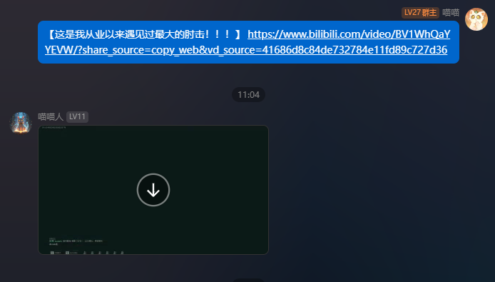
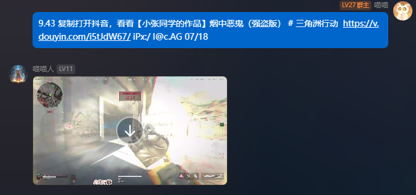
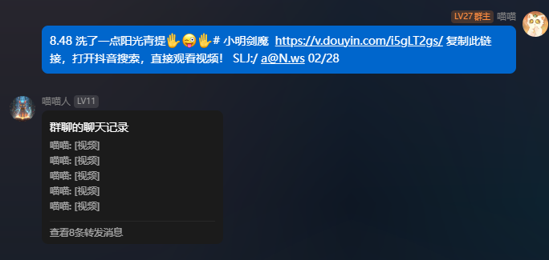

# AstrBot Plugin Videos Analysis

AstrBot 插件，用于解析和下载抖音和 Bilibili 视频。（测试版已上线，有问题请提issue）

**注意，本插件只测试了napcat下的qq，其他协议无法保证可用性**

## 功能

- 自动解析抖音和 Bilibili 视频分享链接
- 直接发送无水印视频到qq
- 支持多段视频和图片的解析与下载

## 安装

直接在插件市场安装

## 使用

**注意，本插件只测试了napcat下的qq，其他协议无法保证可用性**

~~请先部署该项目：https://github.com/Evil0ctal/Douyin_TikTok_Download_API~~

~~本插件使用该项目的api以获取抖音聚合数据解析，由于部分分p视频该api无法正确解析，所以本插件会使用自带的解析脚本进行解析，可能需要手动配置部分cookie及请求头，如果遇到问题可以提issues。~~

默认使用了项目提供的解析api，速度略慢于自主部署，如有需要仍可自行部署后更改解析api

配置完成后可以自动解析抖音分享链接和bilibili分享链接，并发送无水印视频，速度取决于您的服务器带宽和视频大小，效果如下图所示

## 贡献

欢迎提交问题和拉取请求。

## todo

增加视频下载限制，避免导致服务器爆炸

增加对小程序分享的解析

增加视频详情信息

## 许可证

此项目基于 [GNU Affero General Public License](LICENSE) 许可证。
